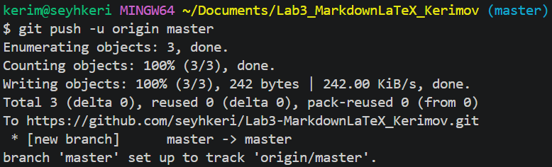
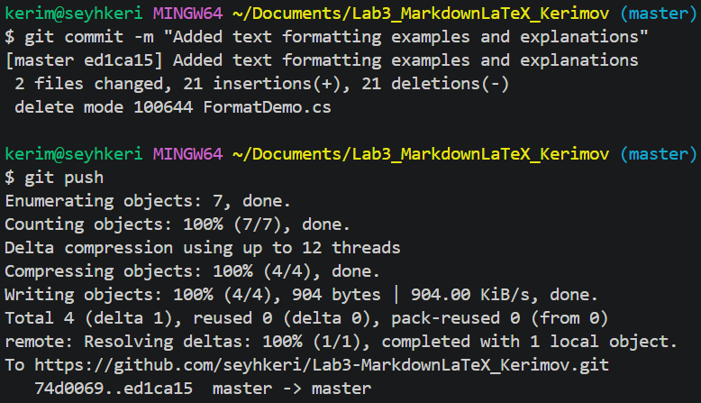

# Ссылки и изображения в Markdown

## Ссылки

* [GitHub](https://github.com)
* [Официальный сайт Markdown](https://markdownguide.org "Перейти на официальный сайт")
* [Поисковая система Яндекс](https://yandex.ru)

## Изображения

